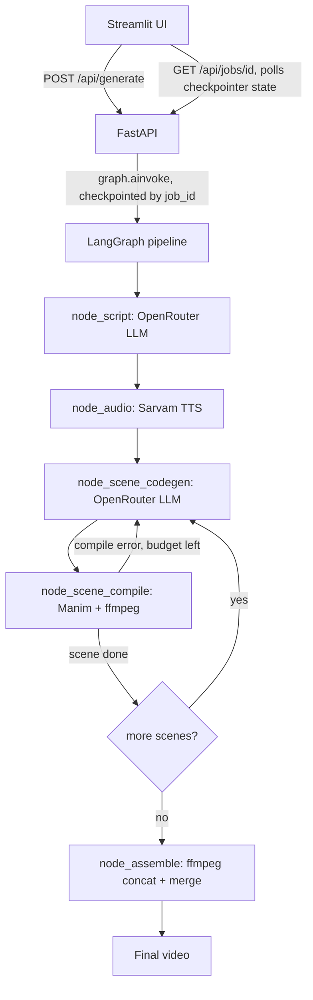

# Conceptreel

Topic → narrated Manim video, with multilingual voiceover (Sarvam, Bengali and other Indic
languages), LLM calls routed through OpenRouter, orchestrated as a LangGraph state machine and
traced via LangSmith.

Rewrite of [topic2manim](../topic2manim), on a different stack. See the plan/context for what
changed and why: TTS provider abstraction (Sarvam), explicit language+font threading, durable
job state via LangGraph's checkpointer instead of an in-memory dict, post-render duration
correction, and a cost cap on the codegen fix-loop.

## Architecture



## Setup

```bash
cd conceptreel
uv sync   # or: python -m venv .venv && pip install .
cp .env.example .env
# fill in OPENROUTER_API_KEY, SARVAM_API_KEY, LANGSMITH_API_KEY
```

Manim also needs system deps (ffmpeg, cairo, pango, latex) and Noto fonts for non-Latin scripts —
see `Dockerfile`, or install the equivalent packages locally if not using Docker.

## Run

```bash
# Terminal 1
uvicorn server:app --reload --port 8000 --app-dir backend

# Terminal 2
streamlit run frontend/app.py
```

Or:

```bash
docker compose up
```

Backend: http://localhost:8000 (docs at `/docs`). Frontend: http://localhost:8501.

## Observability

Set `LANGSMITH_TRACING=true` and `LANGSMITH_API_KEY` in `.env` — every LLM call (script-gen,
codegen, fix) and Sarvam TTS call is traced under the `LANGSMITH_PROJECT` (default `conceptreel`),
giving visibility into fix-loop frequency and failure points that the old pipeline had none of.
